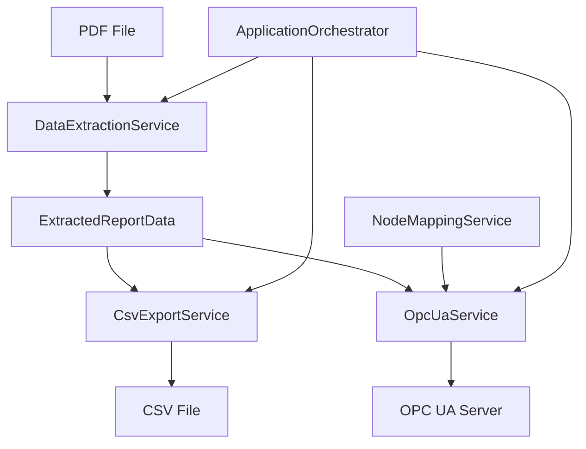

# PDF Data Extractor & OPC UA Client

A robust, enterprise-grade application for extracting data from PDF reports and writing it to OPC UA servers and CSV files. Built with **Clean Architecture** principles and **SOLID** design patterns.

## 🏗️ Architecture Overview

This application follows **Clean Architecture** with proper **Dependency Injection** and **SOLID Principles**:

```
📁 Models/                    # Data models and DTOs
📁 Interfaces/               # Abstractions for loose coupling  
📁 Services/                 # Business logic implementations
📄 Program.cs               # Entry point and workflow coordination
📄 ConfigurationManager.cs  # Configuration management
📄 CertificateManager.cs    # Certificate handling
```

## 🎯 Key Features

- ✅ **PDF Data Extraction** - Comprehensive parsing of GeoPyc density reports
- ✅ **OPC UA Integration** - Full-featured OPC UA client with batch operations
- ✅ **CSV Export** - Structured data export to CSV format
- ✅ **Clean Architecture** - SOLID principles, dependency injection, testable design
- ✅ **Robust Error Handling** - Comprehensive logging and error management
- ✅ **Async Operations** - Non-blocking I/O for better performance
- ✅ **Configuration-Driven** - Flexible configuration via appsettings.json

## 🚀 Quick Start

### Prerequisites
- .NET Framework 4.8 or .NET 8.0
- OPC UA Server (optional, for OPC UA functionality)

### Installation
1. Clone the repository
2. Build the solution: `dotnet build`
3. Configure `appsettings.json` with your OPC UA server settings
4. Run the application: `FileReader.exe`

### Command Line Options
```bash
FileReader.exe                # Normal operation (PDF extraction + export)
FileReader.exe --diagnostic   # Test OPC UA connection
FileReader.exe --setup        # First-time certificate setup
```

## ⚙️ Configuration

Edit `appsettings.json` to configure the application:

```json
{
  "OpcUaSettings": {
    "EndpointUrl": "opc.tcp://127.0.0.1:49320",
    "ApplicationName": "PDF Data Extractor OPC UA Client",
    "SessionTimeout": 60000,
    "NodeMappings": {
      "StartedTime": "ns=2;s=Channel1.Device1.started",
      "CompletedTime": "ns=2;s=Channel1.Device1.completed",
      // ... more mappings
    }
  },
  "ApplicationSettings": {
    "OutputFolderName": "output",
    "CsvFileName": "CompleteExtractedData.csv"
  }
}
```

## 📊 Data Flow



## 🏛️ Architecture Components

### Core Services

#### **DataExtractionService**
- **Responsibility**: Extract data from PDF files
- **Input**: PDF file path
- **Output**: Structured `ExtractedReportData`
- **Features**: Robust parsing, error handling, data validation

#### **OpcUaService**
- **Responsibility**: OPC UA communication
- **Features**: Connection management, batch writes, diagnostics
- **Operations**: Connect, disconnect, read, write, browse

#### **CsvExportService**
- **Responsibility**: CSV file generation
- **Features**: Structured export, proper escaping, async operations

#### **NodeMappingService**
- **Responsibility**: Map extracted data to OPC UA nodes
- **Features**: Configurable mappings, validation, type conversion

#### **ApplicationOrchestrator**
- **Responsibility**: Coordinate workflow execution
- **Features**: Error handling, progress reporting, service coordination

### Data Models

#### **ExtractedReportData**
```csharp
public class ExtractedReportData
{
    public ReportInfo ReportInfo { get; set; }           // Report metadata
    public InstrumentInfo Instrument { get; set; }       // Instrument details
    public SampleInfo Sample { get; set; }               // Sample information
    public MeasurementParameters Parameters { get; set; } // Test parameters
    public MeasurementResults Results { get; set; }      // Test results
    public List<MeasurementCycle> MeasurementCycles { get; set; } // Cycle data
}
```

## 🔧 Development

### SOLID Principles Implementation

1. **Single Responsibility Principle (SRP)**
   - Each service has one clear responsibility
   - Separation of concerns throughout the codebase

2. **Open/Closed Principle (OCP)**
   - Services are open for extension via interfaces
   - Closed for modification - new functionality via new implementations

3. **Liskov Substitution Principle (LSP)**
   - All implementations can substitute their interfaces
   - Mock implementations possible for testing

4. **Interface Segregation Principle (ISP)**
   - Focused, specific interfaces
   - No fat interfaces - clients depend only on what they use

5. **Dependency Inversion Principle (DIP)**
   - High-level modules depend on abstractions
   - Dependency injection throughout

### Testing

The architecture supports comprehensive testing:

```csharp
// Example unit test setup
var mockDataExtraction = new Mock<IDataExtractionService>();
var mockOpcUa = new Mock<IOpcUaService>();
var mockCsvExport = new Mock<ICsvExportService>();

var orchestrator = new ApplicationOrchestrator(
    mockDataExtraction.Object,
    mockOpcUa.Object,
    mockCsvExport.Object,
    configuration
);
```

### Adding New Features

1. **New Export Format**: Implement `IExportService` interface
2. **New Data Source**: Implement `IDataExtractionService` interface
3. **New Communication Protocol**: Implement communication interface

## 📋 Supported Data Fields

The application extracts and exports the following data categories:

### Report Information
- Generated timestamp, Source file, Report date, Serial number, Report type

### Instrument Information
- Instrument name, Serial number, Version

### Sample Information
- Record ID, Operator, Submitter, Start/completion times, Sample mass, Absolute density

### Measurement Parameters
- Chamber diameter, Preparation/measurement cycles, Blank data, Consolidation force, Conversion factor, Zero depth

### Measurement Results
- Average envelope volume/density, Specific pore volume, Porosity, Percent sample volume, Standard deviations

### Measurement Cycles
- Individual cycle data (up to 10 cycles)
- Cycle number, Blank/sample counts, Volume, Density, Deviations

## 🛠️ Troubleshooting

### Common Issues

1. **OPC UA Connection Failed**
   - Run `FileReader.exe --diagnostic` to test connection
   - Check endpoint URL in appsettings.json
   - Verify OPC UA server is running
   - Check firewall settings

2. **Certificate Issues**
   - Run `FileReader.exe --setup` for first-time setup
   - Check certificate store permissions

3. **PDF Extraction Issues**
   - Ensure PDF file is not corrupted
   - Verify PDF contains expected data format
   - Check file permissions

### Logging

The application provides comprehensive console logging:
- ✅ Success operations
- ⚠️ Warnings and recoverable errors
- ❌ Critical failures
- 🔧 Debug information (when enabled)

## 📄 License

This project is licensed under the MIT License - see the LICENSE file for details.

## 🤝 Contributing

1. Fork the repository
2. Create a feature branch
3. Follow SOLID principles and existing architecture patterns
4. Add comprehensive tests
5. Submit a pull request

## 📞 Support

For support and questions:
- Check the troubleshooting section
- Review configuration examples
- Run diagnostic tools (`--diagnostic`, `--setup`)

---

**Built with Clean Architecture principles for maintainability, testability, and extensibility.**